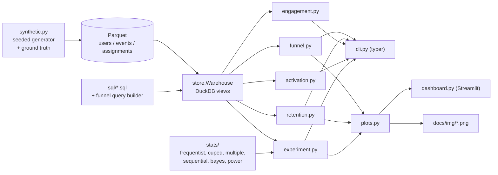

# plg-metrics


Product-led-growth analytics over raw event data: ordered funnels with conversion windows, activation-definition search, weekly cohort retention, stickiness, a north-star metric, and an experiment readout that refuses to let you misread an A/B test. It checks sample-ratio mismatch before showing any result, reduces variance with CUPED, corrects for multiple metrics, flags early peeking with an always-valid sequential test, and reports a Bayesian probability to beat control next to the frequentist interval. Everything runs locally on DuckDB over Parquet. The bundled data is a seeded, **synthetic** B2B SaaS event stream with an embedded onboarding experiment whose true effect is known, so the statistics are checked against ground truth rather than taken on faith.

## Quickstart

```bash
git clone https://github.com/seanmcrae/plg-metrics.git
cd plg-metrics
uv sync --extra dev --locked            # Python 3.11+

uv run plg generate                     # 20,000 synthetic users -> data/synthetic/
uv run plg experiment onboarding_v2     # full A/B readout
uv run plg funnel --by plan             # ordered funnel, 14-day window
uv run plg retention --mode unbounded   # weekly cohort matrix
uv run plg activation                   # which early behaviors predict week-4 retention
uv run plg engagement                   # DAU/WAU/MAU and the north star
uv run plg power --baseline 0.29 --mde 0.02 --daily-units 240

make dashboard                          # Streamlit: funnel, retention, experiment tabs
```

`make ci` runs lint, format check, type check, and tests. `make demo` runs every command above. A Dockerfile serves the dashboard on port 8501.

## Example output

All output below is real, produced by the commands shown on the bundled synthetic dataset (`plg generate`, 20,000 users, seed 7).

### Experiment readout

```text
$ plg experiment onboarding_v2
Experiment: onboarding_v2   data: data/synthetic (SYNTHETIC)
Units: control 4,916 | treatment 5,042
SRM check: chi2 = 1.59, p = 0.207 -> OK (flag if p < 0.001)

metric                role  control  treatment  raw diff  CUPED diff              95% CI       p   p_adj  var red    truth  in CI
---------------  ---------  -------  ---------  --------  ----------  ------------------  ------  ------  -------  -------  -----
activated_14d      primary   0.2878     0.3130   +0.0251     +0.0231  [+0.0054, +0.0407]  0.0104  0.0104     4.1%  +0.0228    yes
active_days_28d  secondary   7.2445     7.5482   +0.3037     +0.2329  [-0.0170, +0.4827]  0.0677  0.1354    19.8%  +0.1748    yes
paid_28d         secondary   0.0862     0.0956   +0.0093     +0.0083  [-0.0028, +0.0194]  0.1442  0.1442     2.6%  +0.0062    yes

CUPED covariate: pre_pageviews. p_adj: holm across secondary metrics; primary tested at alpha.
Bayesian (activated_14d, Beta(1,1) prior): P(treatment > control) = 99.7%, 95% credible diff [+0.0071, +0.0431], expected loss if shipped = 0.00001
Sequential guardrail (mSPRT, tau = 0.02): final always-valid p = 0.0263; first safe stop: 2026-03-24 (look 37 of 42).
  Naive daily peeking at p < 0.05 would have stopped: 2026-02-22 (look 7 of 42).
Power: baseline 28.8%, 4,916 per arm -> MDE at 80% power = 2.59 pp

Decision: SHIP: activated_14d improved with no significant regressions
```

`truth` is the effect the generator actually built in, computed analytically from each enrolled user's outcome probabilities. Every interval covers it. Note the engagement metric: the raw test calls it significant (p = 0.033), while the CUPED-adjusted estimate, which removes 20% of the variance using pre-signup behavior, moves closer to the truth and does not survive. That is the kind of false win this tool exists to catch.


### Funnel

```text
$ plg funnel --by plan
Funnel (14-day window)   data: data/synthetic (SYNTHETIC)

step                 users  conv_from_start  conv_from_prev
-------------------  -----  ---------------  --------------
signup               20000           100.0%          100.0%
create_workspace     16059            80.3%           80.3%
connect_data_source   8740            43.7%           54.4%
create_dashboard      5856            29.3%           67.0%
invite_teammate       2023            10.1%           34.5%
subscribe              447             2.2%           22.1%

Conversion from entry by plan

step                   free   trial
-------------------  ------  ------
signup               100.0%  100.0%
create_workspace      79.5%   82.2%
connect_data_source   41.7%   48.5%
create_dashboard      27.9%   32.5%
invite_teammate        9.7%   11.0%
subscribe              1.7%    3.4%

Hours from entry to step (converters only)

step                 converters  mean_hours    p50    p75    p90
-------------------  ----------  ----------  -----  -----  -----
create_workspace          16059         0.5    0.3    0.6    1.1
connect_data_source        8740        40.9   19.1   49.3  108.6
create_dashboard           5856        87.7   63.7  122.1  200.1
invite_teammate            2023       142.6  125.8  195.5  262.5
subscribe                   447       224.1  230.9  281.0  316.5
```

Only 2.2% of entrants reach `subscribe` inside the 14-day window. Rerunning with `--window-days 112` (the whole observation period) raises that to 4.8% (965 users): the 14-day window hides more than half of the users who eventually reach that step. The time-to-convert table shows why; even the users who pay inside the window take a median 231 hours to get there. Because the funnel is ordered, users who paid without inviting a teammate are not counted at the `subscribe` step.


### Retention and activation


```text
$ plg activation --top 6
Activation search (target: active in days 21-27)   data: data/synthetic (SYNTHETIC)
Base week-4 retention: 43.2%

rule                                  coverage  precision  retention_without  recall  lift     f1
------------------------------------  --------  ---------  -----------------  ------  ----  -----
session_start >= 3 in first 7d           58.2%      66.1%              11.3%   89.1%  1.53  0.759
session_start >= 2 in first 7d           73.7%      57.0%               4.5%   97.3%  1.32  0.719
add_chart >= 1 in first 7d               36.7%      71.4%              26.9%   60.7%  1.65  0.656
connect_data_source >= 1 in first 7d     41.7%      62.9%              29.1%   60.7%  1.46  0.618
session_start >= 5 in first 7d           25.6%      80.8%              30.3%   47.9%  1.87  0.602
view_docs >= 1 in first 7d               38.9%      62.4%              31.0%   56.2%  1.44  0.592
```

### Does the statistics hold up?

`make validate` regenerates the dataset under 100 different seeds and checks the readout against each seed's ground truth (`docs/validation/`):

```text
Ground-truth recovery over 100 seeds (20,000 users each)

metric           seeds  mean_true_effect  mean_cuped_bias  raw_coverage  cuped_coverage  mean_se_ratio  power
---------------  -----  ----------------  ---------------  ------------  --------------  -------------  -----
activated_14d      100            0.0228          -0.0008         93.0%           92.0%         0.9793  68.0%
active_days_28d    100            0.1751          -0.0307         96.0%           93.0%         0.8888  20.0%
paid_28d           100            0.0062           0.0001         96.0%           95.0%         0.9863  17.0%

Decisions: SHIP 68, INCONCLUSIVE 32

A/A peeking (2,000 sims, 30 daily looks): naive false-positive rate 28.4%, mSPRT 0.9%
```

Coverage sits within Monte Carlo error of the nominal 95% (one standard error at 100 seeds is about 2.2 points). Checking a fixed-horizon p-value every day for 30 days produces a false positive in 28% of A/A tests; the mSPRT guardrail holds it under 1%. The 68% empirical power on the primary metric lines up with the 70% the power calculator predicts for a 2.28 pp effect at about 5,000 users per arm, which is the honest answer to "why did a third of these real effects come back inconclusive".

## Architecture



- **Data layer.** `Warehouse` opens a directory of Parquet files as DuckDB views. Analyses run SQL kept in `src/plg/sql/*.sql` with bound `$parameters`; the only SQL assembled in Python is the funnel, whose CTE chain depends on the number of steps, and segment column names, which are validated as identifiers before use.
- **Analyses** return DataFrames or small frozen dataclasses. They know nothing about presentation.
- **Statistics** live in `plg.stats` as pure functions over arrays and counts, so they are tested against scipy and hand calculations without any data layer.
- **Presentation** (`render.py`, `plots.py`, `dashboard.py`) consumes analysis results only. The CLI and dashboard draw the same matplotlib figures.

## Design decisions

- **Funnel semantics are explicit.** Entry is the first occurrence of step 0 in the entry period; each later step must occur at or after the previous matched step and within the window measured from entry. Matching the earliest qualifying event is optimal, so the funnel never undercounts a user who had a valid ordered path. Tied timestamps satisfy ordering because batch loggers often stamp consecutive events identically. All of these cases have unit tests.
- **Retention never shows a zero it has not observed.** Cells a cohort has not fully lived through are blank, and the weighted curve averages complete cells only. Bounded ("active in week N") and unbounded ("active in week N or later") retention are separate modes because they answer different questions.
- **Integrity before results.** The SRM check runs first at p < 0.001; a mismatch turns the decision into INVALID regardless of the metrics.
- **CUPED by default** with a pre-treatment covariate (marketing pageviews in the 14 days before signup). Theta is estimated on the pooled sample, which keeps the estimator unbiased; raw estimates are always printed alongside.
- **Correction family.** The pre-registered primary metric is tested at alpha; Holm (default) or Benjamini-Hochberg adjusts the secondaries. Adding a secondary metric therefore never weakens the primary decision, and fishing among secondaries is still penalized. Any significant regression blocks a ship.
- **Sequential testing via mSPRT** (Johari et al., 2017) rather than alpha spending: it needs no pre-committed number of looks, which matches how teams actually check dashboards. Looks are indexed by enrollment day, with each user scored on a matured outcome window.
- **Bayesian next to frequentist.** P(treatment > control) uses the exact closed form for Beta posteriors, not sampling; the credible interval and expected loss use seeded Monte Carlo so output is reproducible.
- **Ground truth is analytic.** The generator computes each enrolled user's expected outcome under both arms from the same probabilities it samples from, so "truth" is not another noisy simulation.

## Data

All bundled data is synthetic and generated by `src/plg/synthetic.py`; nothing comes from real users or companies, and no third-party data is used. The fictional product has segments by channel, plan, and company size, a latent engagement trait that drives drop-off and churn, a churn hazard that decays with tenure (so retention curves flatten), weekend dips, pre-signup marketing pageviews, and the `onboarding_v2` experiment, which adds a fixed logit lift to the connect-data-source step for users who sign up from day 42. `data/sample_synthetic_3k/` is a committed 3,000-user sample; `plg generate` writes the 20,000-user demo dataset. See `data/README.md` for the schema.

## Limitations

- Signups in the synthetic world stop after week 12, so the last weeks of the stickiness and north-star series reflect an ageing user base with no new acquisition, not product decline.
- Activation search ranks correlations. `session_start >= 3` tops the list because early activity predicts later activity; deciding which behavior onboarding can actually move needs judgement and then an experiment.
- Users are the unit everywhere. Account-level (workspace) analysis and cluster-robust errors for multi-user accounts are not implemented.
- Delta-method intervals are used for relative lift; for very small baselines a Fieller or bootstrap interval would be safer.
- CUPED intervals treat theta as known. At thousands of users per arm the effect on coverage is negligible; on very small samples it is not.
- DuckDB runs in-process on one machine. That is comfortable for tens of millions of events, not for a warehouse-scale event table.

## Roadmap

Problem framing, users, success metrics, trade-offs, and the now / next / later roadmap (warehouse connectors, a metric layer) are in [docs/PRODUCT.md](docs/PRODUCT.md).

## License

MIT, see [LICENSE](LICENSE).
