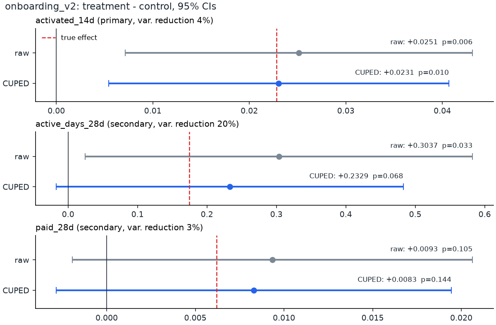
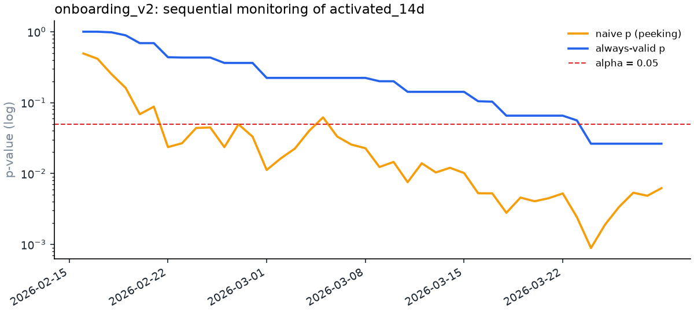
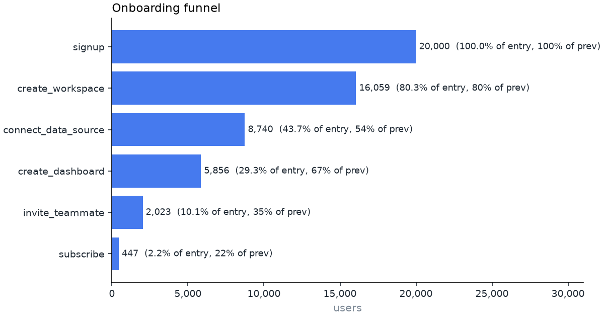
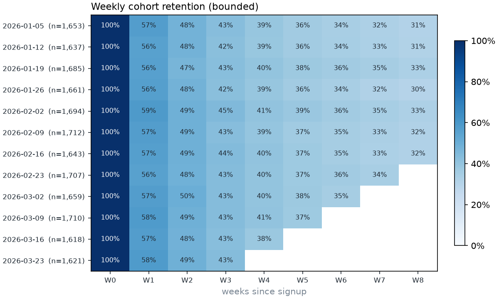
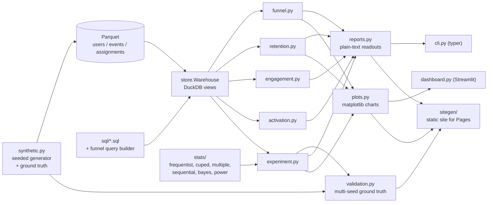

# plg-metrics

[](https://github.com/seanmcrae/plg-metrics/actions/workflows/ci.yml)
[](https://seanmcrae.github.io/plg-metrics/)
[](LICENSE)
[](pyproject.toml)

**Should we ship this experiment? plg-metrics gives a growth team that answer with its evidence, and refuses to give it when the data is broken, the test was peeked at, or a "win" is noise.** It also computes the funnels, retention, and activation rules behind the decision, on DuckDB + Parquet, with every statistic checked against synthetic ground truth.

**Live docs:** [seanmcrae.github.io/plg-metrics](https://seanmcrae.github.io/plg-metrics/)

Growth decisions come from a funnel, a retention chart, and an experiment readout, and all three are easy to misread. plg-metrics computes them from raw events with explicit semantics, and its experiment readout checks sample-ratio mismatch before showing any result, reduces variance with CUPED, corrects for multiple metrics, flags early peeking with an always-valid sequential test, and reports a Bayesian probability to beat control next to the frequentist interval. The bundled data is a seeded, **synthetic** B2B SaaS event stream with an embedded onboarding experiment whose true effect is known, so the statistics are verified rather than taken on faith.

## Numbers

All figures are on the bundled **synthetic** data: `docs/validation/` (100 seeds x 20,000 users, `make validate`) and the seed-7 demo readout below.

| | Result | Compared with |
| --- | --- | --- |
| **False positives under daily peeking** (A/A, 2,000 sims, 30 looks) | **0.9%** with the mSPRT guardrail | 28.4% for naive daily p < 0.05 |
| CUPED 95% CI coverage of the true effect (100 seeds) | 92% / 93% / 95% (activation / active days / paid) | nominal 95%; 1 SE at 100 seeds is about 2.2 pts |
| Variance reduction, CUPED SE / raw SE (100 seeds) | 0.979 activation, 0.889 active days, 0.986 paid | 1.0 = raw difference in means, no reduction |
| Primary-metric power at about 5,000 users per arm | 68% empirical | 70% predicted by `plg power` |
| Demo readout, `activated_14d` | +2.31 pp CUPED lift, 95% CI +0.54 to +4.07 pp | +2.28 pp true built-in effect |
| Eval set | 100 regenerated datasets of 20,000 users; demo dataset 20,000 users, 749k events | |
| Runtime | about 1.5-2.5 s wall time per CLI command, including interpreter start, on a 2-vCPU machine (from `docs/PRODUCT.md`) | p50/p95 not measured |
| Cost per 1k requests | not applicable: runs locally, no paid API or service | |
| Tests | 112, run in CI on Python 3.11 and 3.12 | |

## Headline result

On the bundled synthetic dataset (20,000 users, seed 7), the readout ships `onboarding_v2` on its primary metric with a CUPED lift of +2.31 pp (95% CI +0.54 to +4.07 pp) against a true built-in effect of +2.28 pp. On the secondary engagement metric the raw test reports p = 0.033; the CUPED estimate, with 20% less variance, lands closer to the truth and is not significant (p = 0.068, or 0.135 after Holm). Across 100 regenerated seeds, CUPED intervals cover the true effect 92-95% of the time, and in 2,000 simulated A/A tests with 30 daily looks, naive peeking produces false positives 28.4% of the time versus 0.9% for the mSPRT guardrail.



## Quickstart

```bash
git clone https://github.com/seanmcrae/plg-metrics.git && cd plg-metrics
make install demo        # uv sync, generate 20,000 synthetic users, run every analysis
```

Or command by command (Python 3.11+, [uv](https://docs.astral.sh/uv/)):

```bash
uv sync --extra dev --extra docs --locked
uv run plg generate                     # 20,000 synthetic users -> data/synthetic/
uv run plg experiment onboarding_v2     # full A/B readout
uv run plg funnel --by plan             # ordered funnel, 14-day window
uv run plg retention --mode unbounded   # weekly cohort matrix
uv run plg activation                   # which early behaviors predict week-4 retention
uv run plg engagement                   # DAU/WAU/MAU and the north star
uv run plg power --baseline 0.29 --mde 0.02 --daily-units 240

make dashboard                          # Streamlit: funnel, retention, experiment tabs
make site                               # static docs site -> site/index.html
```

`make ci` runs lint, format check, type check, and tests. A Dockerfile serves the dashboard on port 8501. Nothing needs network access or API keys after install.

## Features

- **Ordered funnels** with conversion windows, entry-period filters, segment breakdowns, and time-to-convert percentiles.
- **Cohort retention**, bounded ("active in week N") and unbounded ("week N or later"), plus day-N retention; unobserved cells stay blank.
- **Engagement**: DAU/WAU/MAU stickiness and a weekly engaged-activated-users north star.
- **Activation search**: early-behavior rules ranked by F1, lift, or precision against week-4 retention.
- **Experiment readout**: SRM check, raw and CUPED estimates with intervals, Holm or Benjamini-Hochberg across secondaries, mSPRT always-valid p-values, beta-binomial P(better) and expected loss, power and MDE, and a one-line decision.
- **Power calculator** for proportions and means, including expected CUPED variance reduction and test duration.
- **Validation harness**: multi-seed ground-truth recovery and an A/A peeking simulation.
- **Outputs**: plain-text CLI, Streamlit dashboard, PNG charts, and a static documentation site.

## Example output

All output below is real, produced by the commands shown on the bundled synthetic dataset (`plg generate`, 20,000 users, seed 7).

### Experiment readout

```text
$ plg experiment onboarding_v2
Experiment: onboarding_v2   data: data/synthetic (SYNTHETIC)
Units: control 4,916 | treatment 5,042
SRM check: chi2 = 1.59, p = 0.207 -> OK (flag if p < 0.001)

metric                role  control  treatment  raw diff   raw p  CUPED diff              95% CI  CUPED p   p_adj  var red    truth  in CI
---------------  ---------  -------  ---------  --------  ------  ----------  ------------------  -------  ------  -------  -------  -----
activated_14d      primary   0.2878     0.3130   +0.0251  0.0062     +0.0231  [+0.0054, +0.0407]   0.0104  0.0104     4.1%  +0.0228    yes
active_days_28d  secondary   7.2445     7.5482   +0.3037  0.0329     +0.2329  [-0.0170, +0.4827]   0.0677  0.1354    19.8%  +0.1748    yes
paid_28d         secondary   0.0862     0.0956   +0.0093  0.1046     +0.0083  [-0.0028, +0.0194]   0.1442  0.1442     2.6%  +0.0062    yes

CUPED covariate: pre_pageviews; 95% CI is for the CUPED diff. p_adj: holm on CUPED p across secondary metrics; primary tested at alpha.
Bayesian (activated_14d, Beta(1,1) prior): P(treatment > control) = 99.7%, 95% credible diff [+0.0071, +0.0431], expected loss if shipped = 0.00001
Sequential guardrail (mSPRT, tau = 0.02): final always-valid p = 0.0263; first safe stop: 2026-03-24 (look 37 of 42).
  Naive daily peeking at p < 0.05 would have stopped: 2026-02-22 (look 7 of 42).
Power: baseline 28.8%, 4,916 per arm -> MDE at 80% power = 2.59 pp

Decision: SHIP: activated_14d improved with no significant regressions
```

`truth` is the effect the generator actually built in, computed analytically from each enrolled user's outcome probabilities. Every interval covers it. On `active_days_28d` the raw test is significant (raw p = 0.0329) while the CUPED estimate, which removes 20% of the variance using pre-signup behavior, moves closer to the truth and is not significant (CUPED p = 0.0677, p_adj = 0.1354). That is the kind of false win this tool exists to catch.



Naive daily peeking would have declared a winner on look 7 of 42; the always-valid test first allows a stop on look 37.

### Funnel

```text
$ plg funnel --by plan
Funnel (14-day window)   data: data/synthetic (SYNTHETIC)

step                 users  conv_from_start  conv_from_prev
-------------------  -----  ---------------  --------------
signup               20000           100.0%          100.0%
create_workspace     16059            80.3%           80.3%
connect_data_source   8740            43.7%           54.4%
create_dashboard      5856            29.3%           67.0%
invite_teammate       2023            10.1%           34.5%
subscribe              447             2.2%           22.1%

Conversion from entry by plan

step                   free   trial
-------------------  ------  ------
signup               100.0%  100.0%
create_workspace      79.5%   82.2%
connect_data_source   41.7%   48.5%
create_dashboard      27.9%   32.5%
invite_teammate        9.7%   11.0%
subscribe              1.7%    3.4%

Hours from entry to step (converters only)

step                 converters  mean_hours    p50    p75    p90
-------------------  ----------  ----------  -----  -----  -----
create_workspace          16059         0.5    0.3    0.6    1.1
connect_data_source        8740        40.9   19.1   49.3  108.6
create_dashboard           5856        87.7   63.7  122.1  200.1
invite_teammate            2023       142.6  125.8  195.5  262.5
subscribe                   447       224.1  230.9  281.0  316.5
```

Only 2.2% of entrants reach `subscribe` inside the 14-day window. Rerunning with `--window-days 112` (the whole observation period) raises that to 4.8% (965 users): the 14-day window hides more than half of the users who eventually reach that step. The time-to-convert table shows why; even the users who pay inside the window take a median 231 hours to get there. Because the funnel is ordered, users who paid without inviting a teammate are not counted at the `subscribe` step.



### Retention and activation



```text
$ plg activation --top 6
Activation search (target: active in days 21-27)   data: data/synthetic (SYNTHETIC)
Base week-4 retention: 43.2%

rule                                  coverage  precision  retention_without  recall  lift     f1
------------------------------------  --------  ---------  -----------------  ------  ----  -----
session_start >= 3 in first 7d           58.2%      66.1%              11.3%   89.1%  1.53  0.759
session_start >= 2 in first 7d           73.7%      57.0%               4.5%   97.3%  1.32  0.719
add_chart >= 1 in first 7d               36.7%      71.4%              26.9%   60.7%  1.65  0.656
connect_data_source >= 1 in first 7d     41.7%      62.9%              29.1%   60.7%  1.46  0.618
session_start >= 5 in first 7d           25.6%      80.8%              30.3%   47.9%  1.87  0.602
view_docs >= 1 in first 7d               38.9%      62.4%              31.0%   56.2%  1.44  0.592
```

## Architecture



- **Data layer.** `Warehouse` opens a directory of Parquet files as DuckDB views. Analyses run SQL kept in `src/plg/sql/*.sql` with bound `$parameters`; the only SQL assembled in Python is the funnel, whose CTE chain depends on the number of steps, and segment column names, which are validated as identifiers before use.
- **Analyses** return DataFrames or small frozen dataclasses. They know nothing about presentation.
- **Statistics** live in `plg.stats` as pure functions over arrays and counts, so they are tested against scipy and hand calculations without any data layer.
- **Presentation** (`render.py`, `plots.py`, `dashboard.py`) consumes analysis results only. The CLI and dashboard draw the same matplotlib figures.
- **Reports and site.** `reports.py` renders each analysis as the plain text the CLI prints; `sitegen/` embeds the same text and charts in the static site, so the docs cannot drift from the code.

## Results

Ground-truth recovery from `make validate`, which regenerates the dataset under 100 seeds and runs the full readout on each (`docs/validation/`):

| metric | mean true effect | mean CUPED bias | raw CI coverage | CUPED CI coverage | CUPED SE / raw SE | power |
| --- | --- | --- | --- | --- | --- | --- |
| `activated_14d` | 0.0228 | -0.0008 | 93% | 92% | 0.979 | 68% |
| `active_days_28d` | 0.1751 | -0.0307 | 96% | 93% | 0.889 | 20% |
| `paid_28d` | 0.0062 | +0.0001 | 96% | 95% | 0.986 | 17% |

Decisions across the 100 seeds: SHIP 68, INCONCLUSIVE 32. A/A peeking (2,000 simulations, 30 daily looks): naive false-positive rate 28.4%, mSPRT 0.9%.

Full output:

```text
Ground-truth recovery over 100 seeds (20,000 users each)

metric           seeds  mean_true_effect  mean_cuped_bias  raw_coverage  cuped_coverage  mean_se_ratio  power
---------------  -----  ----------------  ---------------  ------------  --------------  -------------  -----
activated_14d      100            0.0228          -0.0008         93.0%           92.0%         0.9793  68.0%
active_days_28d    100            0.1751          -0.0307         96.0%           93.0%         0.8888  20.0%
paid_28d           100            0.0062           0.0001         96.0%           95.0%         0.9863  17.0%

Decisions: SHIP 68, INCONCLUSIVE 32

A/A peeking (2,000 sims, 30 daily looks): naive false-positive rate 28.4%, mSPRT 0.9%
```

## How evaluation works

- **Analytic ground truth.** The generator computes each enrolled user's expected outcome under both arms from the same probabilities it samples from and stores the population effect in `metadata.json`. The readout prints it in the `truth` column and whether the interval covers it.
- **Coverage across seeds.** `make validate` reruns everything under 100 seeds. Coverage sits within Monte Carlo error of the nominal 95% (one standard error at 100 seeds is about 2.2 points).
- **Power calibration.** The 68% empirical power on the primary metric lines up with the 70% the power calculator predicts for a 2.28 pp effect at about 5,000 users per arm, which is the honest answer to "why did a third of these real effects come back inconclusive".
- **Peeking.** Checking a fixed-horizon p-value every day for 30 days produces a false positive in 28% of A/A tests; the mSPRT guardrail holds it under 1%.
- **Unit tests** check each statistic against scipy or hand calculations, CUPED interval coverage by simulation on skewed counts, SRM detection on a generator that drops treatment logs, and that an A/A dataset does not produce a SHIP decision. Tests are deterministic and never use the network.

## Where it fails

Read these before trusting a readout. Slices come from the 100-seed validation in `docs/validation/` unless noted.

**Statistical and data limits**

| Failure | Evidence | Tracked |
| --- | --- | --- |
| A real primary effect often comes back INCONCLUSIVE at the bundled size | 32 of 100 seeds; power 68%, MDE 2.59 pp at 4,916 users per arm, for a true +2.28 pp effect | [#6](https://github.com/seanmcrae/plg-metrics/issues/6) |
| Secondary metrics are badly underpowered | power 20% (`active_days_28d`), 17% (`paid_28d`); a real secondary effect is usually missed | [#6](https://github.com/seanmcrae/plg-metrics/issues/6) |
| CUPED does little for the binary primary | SE ratio 0.979 (0.889 on active days); 4.1% variance reduction in the seed-7 readout | [#6](https://github.com/seanmcrae/plg-metrics/issues/6) |
| `active_days_28d` estimates run below the true effect | mean bias -0.027 raw and -0.031 CUPED on a 0.175 effect (about 17%, roughly 2.3 SE), while coverage still reads 93% | [#5](https://github.com/seanmcrae/plg-metrics/issues/5) |
| Primary CUPED coverage sits slightly under nominal | 92% versus 95%, within Monte Carlo error at 100 seeds | |
| Only synthetic, defect-free events have been tested | no duplicates, bots, late events, or unassigned users in the generator; no data-quality checks run before analysis | [#7](https://github.com/seanmcrae/plg-metrics/issues/7) |

**Design and scaffolding limits**

| Failure | Evidence |
| --- | --- |
| Activation search ranks correlations, not causes | `session_start >= 3 in first 7d` tops the list (F1 0.759) because early activity predicts later activity |
| A short funnel window under-reports conversion | 2.2% reach `subscribe` within 14 days versus 4.8% within 112 days on the demo data |
| Users are the only unit | no account-level analysis or cluster-robust errors for multi-user workspaces |
| One machine | DuckDB in-process; fine for tens of millions of events, not a warehouse-scale table |

**Considered and rejected.** O'Brien-Fleming alpha spending for the peeking guardrail. It has more power when the look schedule is fixed in advance and honored, but teams check dashboards whenever they like, so the repo uses mSPRT, which needs no pre-committed number of looks (`docs/PRODUCT.md`, trade-offs). The cost is visible in the demo: the always-valid test first allows a stop on look 37 of 42.

## Limitations

- All results are on synthetic data; see the failure table above for what that leaves untested.
- Signups in the synthetic world stop after week 12, so the last weeks of the stickiness and north-star series reflect an ageing user base with no new acquisition, not product decline.
- Activation search output is a shortlist of correlations; adopting a rule as the activation metric needs judgement and then an experiment.
- Users are the unit everywhere. Account-level (workspace) analysis and cluster-robust errors for multi-user accounts are not implemented.
- Delta-method intervals are used for relative lift; for very small baselines a Fieller or bootstrap interval would be safer.
- CUPED intervals treat theta as known. At thousands of users per arm the effect on coverage is negligible; on very small samples it is not.
- DuckDB runs in-process on one machine. That is comfortable for tens of millions of events, not for a warehouse-scale event table.

## Design decisions

- **Funnel semantics are explicit.** Entry is the first occurrence of step 0 in the entry period; each later step must occur at or after the previous matched step and within the window measured from entry. Matching the earliest qualifying event is optimal, so the funnel never undercounts a user who had a valid ordered path. Tied timestamps satisfy ordering because batch loggers often stamp consecutive events identically. All of these cases have unit tests.
- **Retention never shows a zero it has not observed.** Cells a cohort has not fully lived through are blank, and the weighted curve averages complete cells only. Bounded ("active in week N") and unbounded ("active in week N or later") retention are separate modes because they answer different questions.
- **Integrity before results.** The SRM check runs first at p < 0.001; a mismatch turns the decision into INVALID regardless of the metrics.
- **CUPED by default** with a pre-treatment covariate (marketing pageviews in the 14 days before signup). Theta is estimated on the pooled sample, which keeps the estimator unbiased; raw estimates are always printed alongside.
- **Correction family.** The pre-registered primary metric is tested at alpha; Holm (default) or Benjamini-Hochberg adjusts the secondaries. Adding a secondary metric therefore never weakens the primary decision, and fishing among secondaries is still penalized. Any significant regression blocks a ship.
- **Sequential testing via mSPRT** (Johari et al., 2017) rather than alpha spending: it needs no pre-committed number of looks, which matches how teams actually check dashboards. Looks are indexed by enrollment day, with each user scored on a matured outcome window.
- **Bayesian next to frequentist.** P(treatment > control) uses the exact closed form for Beta posteriors, not sampling; the credible interval and expected loss use seeded Monte Carlo so output is reproducible.
- **Ground truth is analytic.** The generator computes each enrolled user's expected outcome under both arms from the same probabilities it samples from, so "truth" is not another noisy simulation.

## Data

All bundled data is synthetic and generated by `src/plg/synthetic.py`; nothing comes from real users or companies, and no third-party data is used. The fictional product has segments by channel, plan, and company size, a latent engagement trait that drives drop-off and churn, a churn hazard that decays with tenure (so retention curves flatten), weekend dips, pre-signup marketing pageviews, and the `onboarding_v2` experiment, which adds a fixed logit lift to the connect-data-source step for users who sign up from day 42. `data/sample_synthetic_3k/` is a committed 3,000-user sample; `plg generate` writes the 20,000-user demo dataset. See `data/README.md` for the schema.

## Configuration

Every analysis is configured through CLI options (`plg <command> --help`) or the dataclasses behind them:

| What | Where | Defaults |
| --- | --- | --- |
| Synthetic world | `plg generate --users --seed --srm-drop-rate`; `GeneratorConfig` in `synthetic.py` | 20,000 users, seed 7, 84 signup days, 112 observed days, experiment from day 42, logit lift 0.20 |
| Funnel | `plg funnel --steps --window-days --by`; `FunnelSpec` | signup to subscribe, 14-day window |
| Retention | `plg retention --mode --weeks` | bounded, 8 weeks |
| Activation | `plg activation --rank-by --top`; `ActivationSearch` | behaviors in the first 7 days, target active in days 21-27, thresholds 1/2/3/5/8, F1 |
| Experiment | `plg experiment NAME --correction`; `ExperimentConfig` | primary `activated_14d`, CUPED on `pre_pageviews`, alpha 0.05, Holm, mSPRT tau 0.02, SRM flag at p < 0.001 |
| Power | `plg power --baseline --mde --alpha --power --ratio --sd --variance-reduction --daily-units` | alpha 0.05, power 80%, 1:1 |
| Data location | `--data` on every analysis command | `data/synthetic` |

## Project layout

```text
src/plg/
  synthetic.py      seeded SYNTHETIC generator with analytic ground truth
  store.py          DuckDB warehouse over Parquet
  sql/              versioned SQL with bound parameters
  funnel.py  retention.py  engagement.py  activation.py  experiment.py
  stats/            frequentist, cuped, multiple, sequential, bayes, power
  validation.py     multi-seed ground-truth recovery, A/A peeking simulation
  render.py  reports.py  plots.py   text tables, CLI reports, matplotlib charts
  cli.py            typer CLI (plg)
  dashboard.py      Streamlit app
  sitegen/          static site builder and templates
scripts/validate_experiment.py      make validate
data/sample_synthetic_3k/           committed 3,000-user SYNTHETIC sample
docs/                               PRODUCT.md, architecture source, charts, validation output
tests/                              unit and integration tests
```

## Roadmap

Problem framing, users, success metrics, trade-offs, and the now / next / later roadmap (warehouse connectors, a metric layer) are in [docs/PRODUCT.md](docs/PRODUCT.md), also rendered on the [docs site](https://seanmcrae.github.io/plg-metrics/product.html).

## How this was built

Code was written with AI coding agents under my direction. I set the problem, success metrics and eval gates, and decided what shipped. Every number here comes from the committed eval scripts (`make validate` and the demo commands); CI reruns the tests, the demo readout, and the site build on every push.

## Contributing

See [CONTRIBUTING.md](CONTRIBUTING.md). Report security issues as described in [SECURITY.md](SECURITY.md). Changes are tracked in [CHANGELOG.md](CHANGELOG.md); cite with [CITATION.cff](CITATION.cff).

## License

MIT, see [LICENSE](LICENSE).
